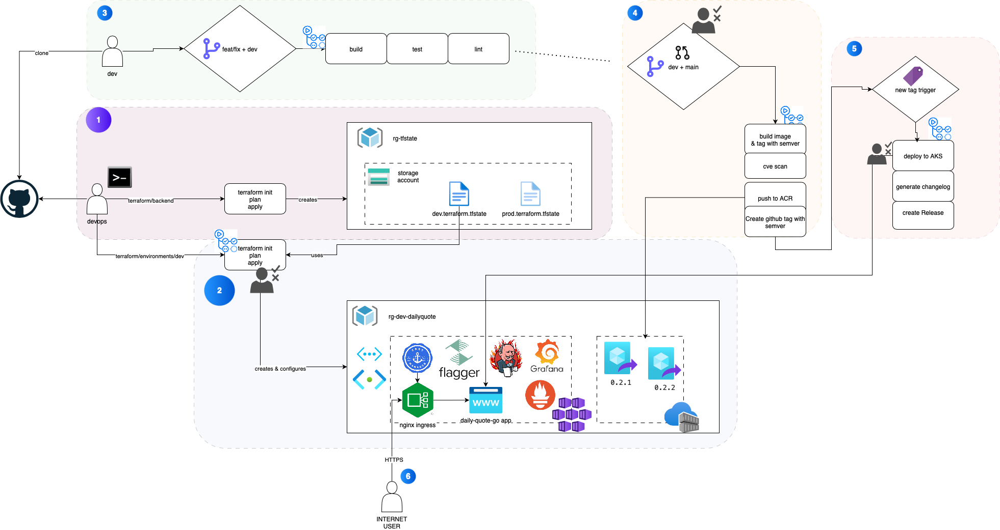

# Daily quote generator

A simple Go web application that fetches and serves daily quotes using a public API. Built for cloud-native deployment with full CI/CD and Infrastructure as Code (IaC) using modern DevOps tools.

## ✨ Features

- Go microservice
- Containerized with Docker
- Deployed to Azure Kubernetes Service (AKS)
- CI/CD with GitHub Actions
- Ingress-NGINX + Cert-Manager + Cloudflare for secure HTTPS
- Secure via ingress-nginx, cert-manager, and Cloudflare DNS + TLS
- Canary deployments with [Flagger](https://flagger.app)
- OIDC-based Azure authentication (no secrets in CI)
- CVE scanning, linting, code coverage, semantic versioning
- Strong GitHub workflows: branch protection, PR rules & code quality checks
- Auto-labeling, PR branch rules, deployment & branch protection

## 🧩 Workflow

Below is an overview of the complete workflow.



## 🏗️ Infrastructure

Provisioned via Terraform (`/deployments/terraform`) and structured into:
- `backend/`: bootstrap remote backend (Azure Storage)
- `modules/`: reusable infrastructure modules (networking, AKS, ACR, etc.)
- `environments/dev/`: environment-specific values/resources

1. Bootstrap remote backend (manual, run once)
Before managing any infrastructure, the Terraform remote state must be initialized:
```
cd deployments/terraform/backend
terraform init
terraform apply
```

2. Provision infrastructure (via GitHub Actions)
Once the backend is ready, infrastructure can be deployed using a manually triggered GitHub Actions workflow (`workflow_dispatch`). This ensures:
- Auditable infra changes
- Manual oversight before provisioning or updating cloud resources
The plan and apply stages:
- Use the remote backend for state management
- Authenticate securely to Azure using GitHub OIDC
- Configure everything inside the specified environment (`dev` by default)
- Plan is outputted to summary, can be reviewed before apply stage (that requires review and manual approval)

Terraform with help of Helm sets up the following:
| Resource                           | Description                                     |
| ---------------------------------- | ----------------------------------------------- |
| **AKS Cluster**                    | Azure-managed Kubernetes cluster                |
| **Azure Container Registry (ACR)** | Stores and serves Docker images                 |
| **Ingress-NGINX**                  | Manages HTTP ingress into AKS                   |
| **Cert-Manager**                   | Issues TLS certs via Let's Encrypt + Cloudflare |
| **Flagger**                        | Enables progressive canary deployments          |
| **Jenkins (Helm)**                 | CI/CD runner deployed into the AKS cluster      |
| **Prometheus**                     | Metrics gathering for apps and infrastructure   |
| **Grafana**                        | Dashboards and monitoring visualization         |


## 🚀 CI/CD Workflows

GitHub Actions as CI/CD tool with these stages:

### Lint & Test
> triggered on push to main or any PR
- Set up Go 1.24
- Build the application binary
- Run unit tests

### Build & Push to Azure Container Registry (ACR)
> trigerred on push to main only if files under `build/`, `cmd/` or `web/` modified
- Build the Docker image
- Authenticate to Azure using GitHub OIDC
- Tag the image using semantic versioning & latest
- Push to Azure Container Registry

### Versioned Release & Deployment to AKS
> trigerred on git tag push matching `v*` (e.g. `v0.1.1`)
- Extracts version from Git tag
- Log in to Azure via OIDC
- Set the correct AKS cluster context
- Build the Go binary
- Package the binary into .tar.gz with SHA256 checksum to attach to release
- Deploy the latest Helm chart to AKS using the tagged image
- Publish a GitHub release with autogenerated notes

> Deployment to AKS is protected - requires manual approval


## 🛡️ Workflow security & controls

### Branch protection rules

- `main` is a protected branch.
- Pull requests **must be approved** by at least 1 reviewer.
- **Status checks** (tests, linter, scan) must pass before merging.
- **Force pushes** and **deletions** on `main` are disabled.

### Deployment Protection Rules

- **OIDC-based authentication** is used to securely deploy to Azure from GitHub Actions.
- Deployments to production (`main`) require:
  - PR from `dev` branch
  - Approval by authorized reviewers
  - Pipeline checks passed

### PR branch checks

- Merges to `main` are **only allowed from `dev`**
- Direct pushes to `main` are blocked


## 🚀 Canary Deployment with Flagger

- Canary releases are managed by [Flagger](https://docs.flagger.app/)
- Automatically promotes or rolls back based on:
  - HTTP checks
  - Error rate thresholds
  - Request duration metrics

## 🚀 Getting started

### Prerequisites

1. Configure OIDC trust between GitHub Actions and Azure:
- Add a Federated Credential in Azure AD for your GitHub repository
- Assign appropriate roles (Contributor) to the identity
- Create secrets for `AZURE_CLIENT_ID`, `AZURE_TENANT_ID`, and `AZURE_SUBSCRIPTION_ID`. Copy these values from your Microsoft Entra application or user-assigned managed identity for your GitHub secrets

2. Create a Cloudflare API token with:
- Zone:DNS:Edit
- Zone:Zone:Read
- Add it as a GitHub secret: `CLOUDFLARE_API_TOKEN`

3. Store the following secrets in your repository settings under Settings > Secrets and variables > Actions:

| Name                    | Purpose                                   |
| ----------------------- | ----------------------------------------- |
| `ARM_CLIENT_ID`         | Azure OIDC client ID                      |
| `ARM_SUBSCRIPTION_ID`   | Azure subscription                        |
| `ARM_TENANT_ID`         | Azure tenant ID                           |
| `CLOUDFLARE_API_TOKEN`  | Cloudflare DNS & cert manager             |
| `REGISTRY_LOGIN_SERVER` | ACR login server (e.g., `xyz.azurecr.io`) |
| `REGISTRY_USERNAME`     | ACR username (optional with OIDC)         |
| `REGISTRY_PASSWORD`     | ACR password (optional with OIDC)         |


### Check the CI/CD flow

1) Push to main:
    - Triggers build, test, and Docker image build.
    - Pushes image to Azure Container Registry (ACR).
    - Automatically tags the release version (e.g., v1.2.0).
2) Tag Release (v*):
    - Triggers deployment to Azure Kubernetes Service (AKS).
    - Flagger starts a canary rollout.
    - GitHub publishes a release with changelog & SHA256.
3) ✅ Deployment requires manual approval in GitHub via environment protection rules.
4) Access the live app at: [https://rikardo.zip](https://rikardo.zip)

Canary release with Flagger
After a new release is deployed:
- Flagger automatically begins a progressive canary deployment:
- Routes initial traffic to the new version.
- Verifies success via metrics (Prometheus).
- Gradually shifts all traffic if healthy.

### Access microservices

1. The daily quote Go app
[https://rikardo.zip](https://rikardo.zip)

2. Jenkins
```
kubectl --namespace jenkins port-forward svc/jenkins 8080:8080
```
Go to [http://localhost:8080](http://localhost:8080)

3. Prometheus
```
kubectl port-forward svc/kube-prometheus-stack-prometheus -n monitoring 9090:9090
```
Go to [http://localhost:9090](http://localhost:9090)

4. Grafana
```
kubectl port-forward svc/kube-prometheus-stack-grafana -n monitoring 3000:80
```
Go to [http://localhost:3000](http://localhost:3000)

### Running locally

1. Clone repo
```
git clone https://github.com/rikardoricz/daily-quote-go
```

2. Go to project directory and start the app

```sh
cd daily-quote-go
```
Choose your way of running the app:

- **run without building**
```sh
go run ./cmd/main.go
```

- **or build and run**
```sh
go build -o bin/app ./cmd && ./bin/app
```

- **or build and run container**
```sh
docker build -t daily-quote-go:v0.1 -f build/Dockerfile . && docker run -p 8080:8080 daily-quote-go:v0.1
```

3. Access [http://localhost:8080](http://localhost:8080) in browser